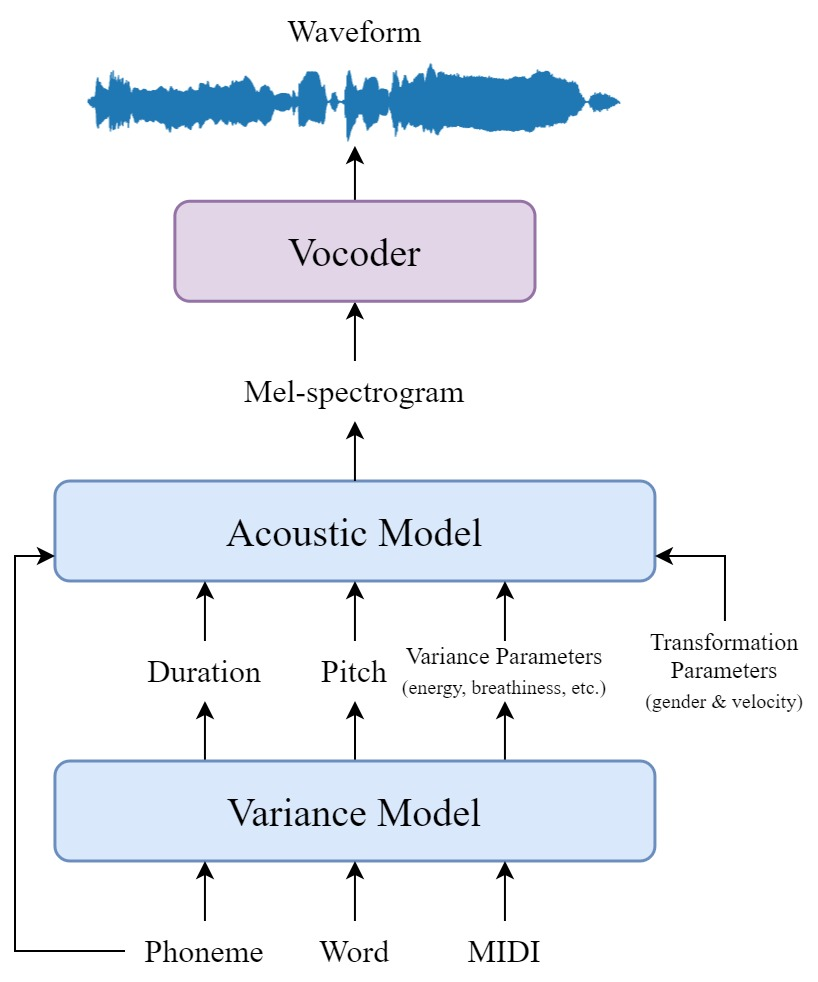
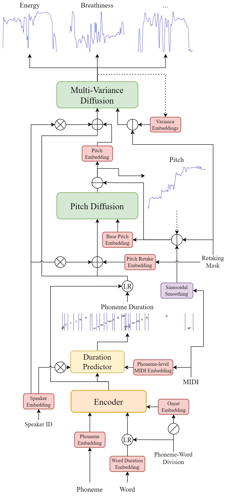
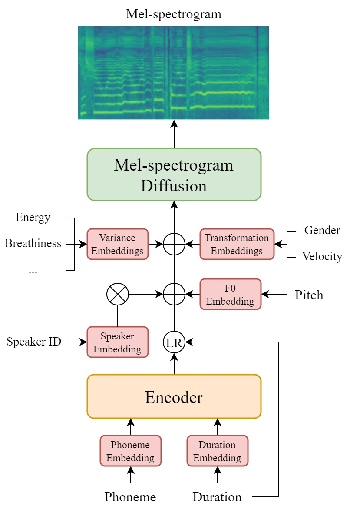

# DiffSinger (XMTech maintained version)

这是由XMTech维护的，基于OpenVPI维护的DiffSinger的二次开发分支，代码克隆于2023年10月8日。
 相较于原版仓库，本分支拥有更快的训练速度，完善的拼接引擎授权声库声库迁移流程，以及更简易的训练步骤。
 在前期，我们会保证代码与原版仓库的兼容性，并在后续版本中提供更多的功能。

This is a fork of DiffSinger maintained by XMTech, cloned on 2023-10-08.
Compared to the original repository, this branch has faster training speed, a well-designed splicing engine, and a more streamlined training process.
We will ensure compatibility with the original repository in the early stages, and provide more features in subsequent versions.

## 不兼容更新预告 Notice of Incompatible Update

为方便后续更新维护，由 XMTech 的 DiffSinger 分支将在近期进行功能性切割，不再确保与 OpenVPI 仓库 DiffSinger 保持兼容。
 导出的 ONNX 文件不能确保在当前任何版本 OpenUtau 中调用，我们会开发临时的推理服务端用于图形化推理（接口类似于 ENUNU_Server）。
 【新增】
 1.新增对 refinegan 声码器的支持，并将默认推荐声码器修改为 Kouon_Vocoder_refinegan。
 （Kouon_Vocoder 公测群号：749073684）
 2.新增 multi-langs 项目词典支持，并将默认配置文件的词典替换为 multi-langs 三段式中文词典。
 【修改】
 1.取消独立的预处理步骤，优化训练流程，当不存在对应 binary 文件夹时自动进行预处理。
 2.将 checkpoints 目录名替换为 ckpt，以保证在 jupyter-lab 中正常打开模型文件夹。
 3.优化 onnx 文件导出流程。
 【移除】
 1.彻底移除残留的 DiffSpeech 组件。
 2.移除唱法模型流程，初版本仅支持性别与辅音速度。

 In order to facilitate subsequent update maintenance, the DiffSinger branch maintained by XMTech will be functional cut in the near future, and compatibility with the DiffSinger repository in the OpenVPI warehouse will no longer be guaranteed.
 The ONNX files exported cannot ensure compatibility with any current version of OpenUtau, and we will develop a temporary inference server for graphical inference (with an interface similar to ENUNU_Server).
 【New】
 1.Add support for refinegan vocoder, and change the default recommended vocoder to Kouon_Vocoder_refinegan.
 (Kouon_Vocoder public test QQ group number: 749073684)
 2.Add multi-langs project dictionary support, and replace the dictionary in the default configuration file with the three-part Chinese dictionary.
 【Modify】
 1.Cancel the independent preprocessing step, optimize the training process, and automatically perform preprocessing when the corresponding binary folder does not exist.
 2.Replace the checkpoints directory name with ckpt to ensure normal opening of the model folder in jupyter-lab.
 3.Optimize the export process of onnx files.
 【Remove】
 1.Completely remove the residual DiffSpeech components.
 2.Remove the variance model workflow and create a preliminary version that supports gender and vel.

## References
- **DiffSinger**: [Original](https://github.com/MoonInTheRiver/DiffSinger),[OpenVPI maintained version](https://github.com/openvpi/DiffSinger)
- **DiffSinger_XMTech_Maintained_Version**: [Github](https://github.com/komisteng/DiffSinger),[启智 OpenI](https://openi.pcl.ac.cn/XMTech/DiffSinger)
- **DiffSinger_Toolkit 声库制作辅助工具**: [启智 OpenI](https://openi.pcl.ac.cn/XMTech/DiffSinger_Toolkit)
- **OpenUtau**: [Github](https://github.com/stakira/OpenUtau)
- **OpenUtau For DiffSinger 白糖の正义铃维护版本**: [Github](https://github.com/atonyxu/OpenUtau)
- **XMTech VCS Vocoder 社区版本**: [启智 OpenI](https://openi.pcl.ac.cn/XMTech/XMTech_VCS_Hifigan_Vocoder_Community)

## License
本分支受Apache 2.0 License 开源协议保护。

This branch is licensed under the Apache 2.0 License.

英文翻译：智谱GeekCodeX
English translation: GeekCodeX

---

# DiffSinger (OpenVPI maintained version)

This is a refactored and enhanced version of _DiffSinger: Singing Voice Synthesis via Shallow Diffusion Mechanism_ based on the original [paper](https://arxiv.org/abs/2105.02446) and [implementation](https://github.com/MoonInTheRiver/DiffSinger), which provides:

- Cleaner code structure: useless and redundant files are removed and the others are re-organized.
- Better sound quality: the sampling rate of synthesized audio are adapted to 44.1 kHz instead of the original 24 kHz.
- Higher fidelity: improved acoustic models and diffusion sampling acceleration algorithms are integrated.
- More controllability: introduced variance models and parameters for prediction and control of pitch, energy, breathiness, etc.
- Production compatibility: functionalities are designed to match the requirements of production deployment and the SVS communities.

|                                       Overview                                        |                                    Variance Model                                     |                                    Acoustic Model                                     |
|:-------------------------------------------------------------------------------------:|:-------------------------------------------------------------------------------------:|:-------------------------------------------------------------------------------------:|
|  |  |  |

## User Guidance

> 中文教程 / Chinese Tutorials: [Text](https://openvpi-docs.feishu.cn/wiki/KmBFwoYDEixrS4kHcTAcajPinPe), [Video](https://www.bilibili.com/video/BV1xN411F7yM)

- **Installation & basic usages**: See [Getting Started](docs/GettingStarted.md)
- **Dataset creation pipelines & tools**: See [MakeDiffSinger](https://github.com/openvpi/MakeDiffSinger)
- **Best practices & tutorials**: See [Best Practices](docs/BestPractices.md)
- **Editing configurations**: See [Configuration Schemas](docs/ConfigurationSchemas.md)
- **Deployment & production**: [OpenUTAU for DiffSinger](https://github.com/xunmengshe/OpenUtau), [DiffScope (under development)](https://github.com/SineStriker/qsynthesis-revenge)
- **Communication groups**: [QQ Group](http://qm.qq.com/cgi-bin/qm/qr?_wv=1027&k=fibG_dxuPW5maUJwe9_ya5-zFcIwaoOR&authKey=ZgLCG5EqQVUGCID1nfKei8tCnlQHAmD9koxebFXv5WfUchhLwWxb52o1pimNai5A&noverify=0&group_code=907879266) (907879266), [Discord server](https://discord.gg/wwbu2JUMjj)

## Progress & Roadmap

- **Progress since we forked into this repository**: See [Releases](https://github.com/openvpi/DiffSinger/releases)
- **Roadmap for future releases**: See [Project Board](https://github.com/orgs/openvpi/projects/1)
- **Thoughts, proposals & ideas**: See [Discussions](https://github.com/openvpi/DiffSinger/discussions)

## Architecture & Algorithms

TBD

## Development Resources

TBD

## References

- Original DiffSinger: [paper](https://arxiv.org/abs/2105.02446), [implementation](https://github.com/MoonInTheRiver/DiffSinger)
- [HiFi-GAN](https://github.com/jik876/hifi-gan) and [NSF](https://github.com/nii-yamagishilab/project-NN-Pytorch-scripts/tree/master/project/01-nsf) for waveform reconstruction
- [pc-ddsp](https://github.com/yxlllc/pc-ddsp) for waveform reconstruction
- [DDIM](https://arxiv.org/abs/2010.02502) for diffusion sampling acceleration
- [PNDM](https://arxiv.org/abs/2202.09778) for diffusion sampling acceleration
- [DPM-Solver++](https://github.com/LuChengTHU/dpm-solver) for diffusion sampling acceleration
- [UniPC](https://github.com/wl-zhao/UniPC) for diffusion sampling acceleration
- [RMVPE](https://github.com/Dream-High/RMVPE) and yxlllc's [fork](https://github.com/yxlllc/RMVPE) for pitch extraction

## Disclaimer

Any organization or individual is prohibited from using any functionalities included in this repository to generate someone's speech without his/her consent, including but not limited to government leaders, political figures, and celebrities. If you do not comply with this item, you could be in violation of copyright laws.

## License

This forked DiffSinger repository is licensed under the [Apache 2.0 License](LICENSE).

